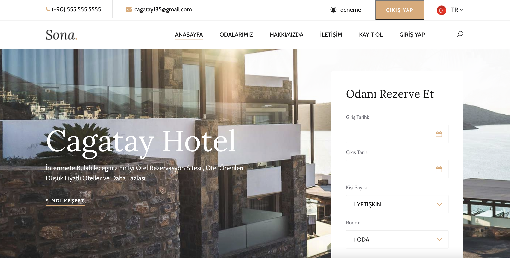

# Hotel App with Ruby Sinatra 
<p align="center">
    
</p>

# Features 
+ Admin page with CRUD operations
+ Authentication
+ Mail sending
+ Room reservation

## Installation and Setup Instructions
```shell
bundle install
```

And run with:

```shell
ruby main.rb
```

View at: [http://localhost:4567](http://localhost:4567)